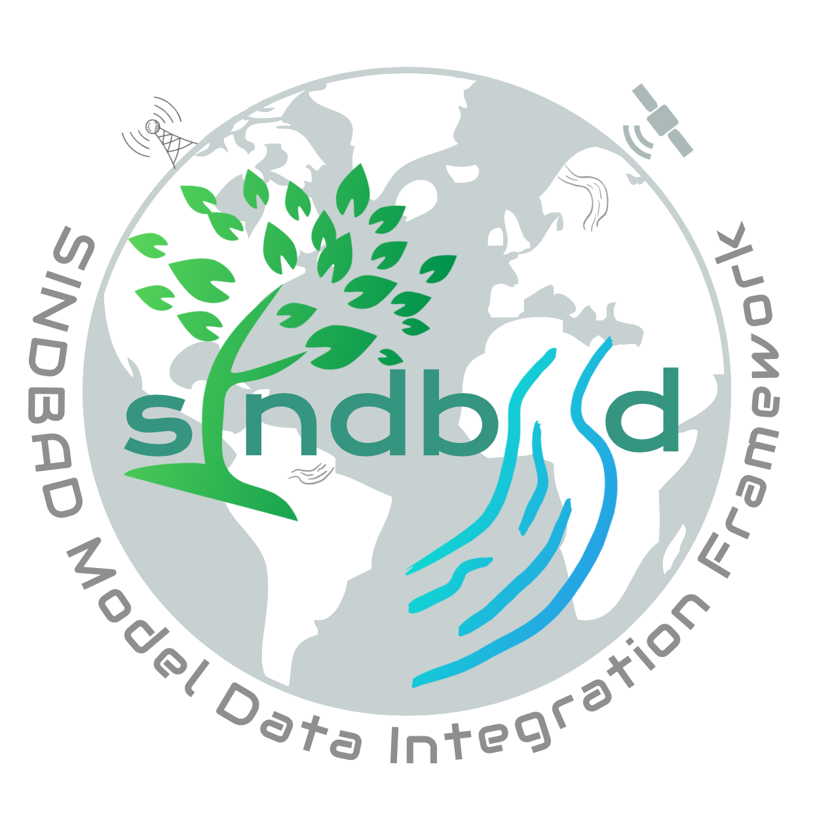

# Sindbad.jl

<div align="center">

[![][docs-stable-img]][docs-stable-url][![][docs-dev-img]][docs-dev-url][![][discussions-img]][discussions-url][![][ci-img]][ci-url] [![][codecov-img]][codecov-url][![Julia][julia-img]][julia-url][![][code-of-conduct-img]][code-of-conduct-url][![][contributors-img]][contributors-url][](https://github.com/EarthyScience/Sindbad.jl/blob/main/LICENSE) 

</div>



[docs-dev-img]: https://img.shields.io/badge/docs-in%20development-orange?style=flat-square
[docs-dev-url]: https://earthyscience.github.io/Sindbad.jl/dev/

[docs-stable-img]: https://img.shields.io/badge/docs-stable-blue.svg
[docs-stable-url]: https://earthyscience.github.io/Sindbad.jl/dev/

[codecov-img]: https://codecov.io/gh/EarthyScience/Sindbad.jl/branch/master/graph/badge.svg
[codecov-url]: https://codecov.io/gh/EarthyScience/Sindbad.jl

[ci-img]: https://github.com/EarthyScience/Sindbad.jl/workflows/CI/badge.svg
[ci-url]: https://github.com/EarthyScience/Sindbad.jl/actions?query=workflow%3ACI

[julia-img]: https://img.shields.io/badge/julia-v1.10+-blue.svg
[julia-url]: https://julialang.org/
[code-of-conduct-img]: https://img.shields.io/badge/contributor-covenant-code
[code-of-conduct-url]: https://github.com/EarthyScience/Sindbad.jl/blob/main/CODE_OF_CONDUCT.md
[discussions-img]: https://img.shields.io/badge/Ask%20us-anything-1abc9c.svg?style=flat-square
[discussions-url]: https://github.com/EarthyScience/Sindbad.jl/discussions
[contributors-img]: https://img.shields.io/badge/Contributor's%20Guide-blueviolet?style=flat-square
[contributors-url]: https://github.com/EarthyScience/Sindbad.jl/blob/main/CONTRIBUTING.md


Welcome to the git repository for the development of the framework for **S**trategies to **IN**tegrate **D**ata and **B**iogeochemic**A**l mo**D**els `(SINDBAD)`. 

Researchers and developers actively developing the model and doing research using [this public SINDBAD repo](https://github.com/EarthyScience/SINDBAD) are encouraged to contact and join [the RnD-Team](./governance4RnD.md), which provides "beta" updates under active development.

`SINDBAD` is a model data integration framework that encompasses the `biogeochemical cycles of water and carbon`, allows for extensive and flexible integration of parsimonious models with a diverse set of observational data streams.

### Installation

within Julia's package manager

```julia
julia > ] # type ] to enter the package mode
```

> [!TIP] 
> Use the following if you want to use the latest registered released version, if available.
> ```julia
> (@v1.12) pkg> add Sindbad
> ```

> [!CAUTION]
> Get the latest changes
> ```julia
> (@v1.12) pkg> add https://github.com/EarthyScience/SINDBAD.git
> ```


and now doing 

```julia
julia > using Sindbad
```

will allow you to run a full experiment.

#### Install only `SindbadCore`

If you only need the core functionality then do

> [!TIP] 
> Use the following if you want to use the latest registered released version, if available.
> ```julia
> (@v1.12) pkg> add SindbadCore
> ```

otherwise do

```julia
(@v1.12) pkg> add https://github.com/EarthyScience/SINDBAD.git:SindbadCore
```

### Repository Structure

`Sindbad.jl` and `SindbadCore.jl` live in the SINDBAD `monorepo`.

For a short description on each see:

<details>
  <summary><span style="color:orange"> 🔥 Click for details 🔥</span></summary>

- `DataLoaders.jl`: includes functions to load the forcing and observation data, and has dev dependency on SindbadUtils.

- `Experiment.jl`: includes the dev dependencies on all other Sindbad packages that can be used to run an experiment and save the experiment outputs.

- `SindbadCore.Metrics.jl`: includes the calculation of loss metrics.

- `ML.jl`: includes functions to do hybrid modeling.

- `Optimization.jl`: includes the optimization schemes and functions to optimize the model.

- `Setup.jl`: includes the setup of sindbad model structure and info from the json settings.

- `TEM.jl`: includes the main functions to run SINDBAD Terrestrial Ecosystem Model.

- `Utilities.jl`: includes utility functions that are used in other Sindbad `modules`.

</details>

### How to use `Sindbad.jl` in a development setting!

<details>
  <summary><span style="color:orange"> 🔥 Click for details 🔥</span></summary>

#### git clone the repo

Get the latest `Sindbad.jl` package and browse to the directory (SINDBAD)

```sh
git clone https://github.com/EarthyScience/SINDBAD.git
```
Start a julia prompt in the SINDBAD root directory

```
julia
```

Go to main sandbox directory
```
julia> run(`cd sandbox`)
```

Create a new sandbox directory, e.g., my_env and go into that directory

```
julia > run(`mkdir -p my_env`)
julia > run(`cd my_env`)
```

Create the julia environment, activate it, and instantiate all dev dependencies and packages by pasting the following in the package mode of Julia REPL.


```julia
julia>] # type ] to enter the package mode
```

```julia
(@v1.12) pkg> activate .
```

```julia
(my_env) pkg> dev ../..
```
and if you want to also develop `SindbadCore` and use those changes do

```julia
(my_env) pkg> dev ../../SindbadCore/
```

Once the dev dependencies are built, run
```
resolve
instantiate
```

and if you query the `status` of your current envioroment you should see something like:

```julia
(my_env) pkg> st
Status `~/SINDBAD/sandbox/my_env/Project.toml`
  [6686e6de] Sindbad v0.1.0 `../..`
  [7e5cc002] SindbadCore v0.1.0 `../../SindbadCore`
```
</details>

## SINDBAD Contributors 

SINDBAD is developed at the Department of Biogeochemical Integration of the Max Planck Institute for Biogeochemistry in Jena, Germany with the following active contributors
with active contributions from [Sujan Koirala](https://www.bgc-jena.mpg.de/person/skoirala/2206), [Xu Shan](https://www.bgc-jena.mpg.de/person/138641/2206), [Jialiang Zhou](https://www.bgc-jena.mpg.de/person/137086/2206), [Lazaro Alonso](https://www.bgc-jena.mpg.de/person/lalonso/2206), [Fabian Gans](https://www.bgc-jena.mpg.de/person/fgans/4777761), [Felix Cremer](https://www.bgc-jena.mpg.de/person/fcremer/2206), [Nuno Carvalhais](https://www.bgc-jena.mpg.de/person/ncarval/2206).

For a full list of current and previous contributors, see http://sindbad-mdi.org/pages/about/team.html

## Copyright and license


**SINDBAD: Strategies to Integrate Data and Biogeochemical Models**  

**Copyright © 2025**  
Max-Planck-Gesellschaft zur Förderung der Wissenschaften

For copyright details, see the [NOTICE](./NOTICE) file.

---

#### License

SINDBAD is free and open-source software, licensed under the [European Union Public License v1.2 (EUPL)](https://eupl.eu/1.2/en).

---

#### Your Rights

You are free to:

- Copy, modify, and redistribute the code  
- Use the software as a package in your own projects, regardless of their license or copyright status  
- Apply the software in both commercial and non-commercial contexts  

---

#### Your Responsibilities

If you modify the code — excluding changes made solely for interoperability — you **must redistribute the modified version under the EUPL v1.2 or a compatible license**. This ensures the long-term sustainability of the project and supports an open, inclusive, and collaborative community.

---

#### Disclaimer

This software is provided in the hope that it will be useful, but **without any warranty** — including, without limitation, the implied warranties of merchantability or fitness for a particular purpose.
