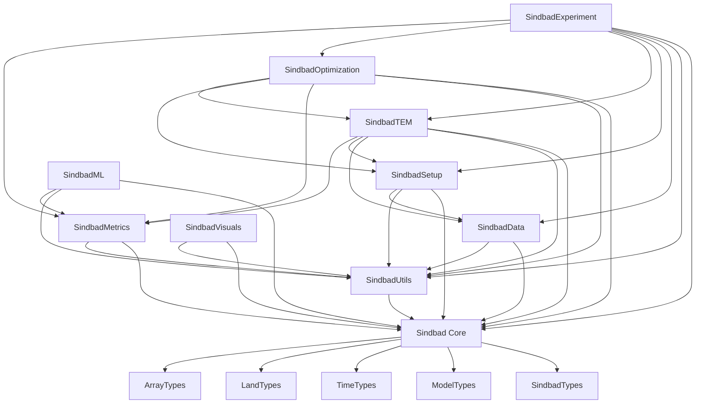

# SINDBAD Packages Overview

This page provides an overview of all SINDBAD packages and their main functionalities.

| Package | Description | Key Features |
|---------|-------------|--------------|
| [Core](sindbad.md) | Core package `Sindbad` | Main framework for model core and processes |
| [ Models](models.md) | Model implementations | Ecosystem model processes and approaches |
| [ Types](types.md) | SINDBAD Types | Definition of all SINDBAD types and purposes |
| [Data](data.md) | Data handling | Input/output operations, data processing, and handling |
| [Experiment](experiment.md) | Simulation experiments | Experiment setup, configuration, and execution |
| [Metrics](metrics.md) | Performance metrics | Cost functions, evaluation metrics, and validation tools |
| [ML](ml.md) | Machine learning | Machine learning integration and model training |
| [Optimization](optimization.md) | Optimization methods | Parameter optimization and calibration |
| [Setup](setup.md) | Setup utilities | configuration of SINDBAD experiment and setup |
| [TEM](tem.md) | Terrestrial Ecosystem Model | Core ecosystem modeling framework |
| [Utils](utils.md) | Utility functions | Helper functions and common utilities for all packages|
| [Visuals](visuals.md) | Visualization tools | Plotting and data visualization (to be developed..) |


## Code Documentation

The code documentation is automatically generated from the docstrings of the definitions and functions.

::: tip What are `Exported` and `Internal` entities/code/functions?

- `Exported` entities (functions, structs, types, constants):

These are explicitly made available to users using the `export` keyword, allowing them to be accessed without prefixing them with the module name.

- `Internal` entities (non-exported):

These remain accessible but require qualification with the module name (e.g., `MyModule.SomeType`), indicating that they are intended for internal use.

:::
## Sindbad Package Dependencies

```sh
graph TD
    ## Main Sindbad package
    Sindbad[Sindbad Core] --> SindbadTypes[SindbadTypes]
    Sindbad[Sindbad Core] --> SindbadModels[Models]
    
    ## Core dependencies
    Sindbad --> ModelTypes[ModelTypes]
    Sindbad --> TimeTypes[TimeTypes]
    Sindbad --> LandTypes[LandTypes]
    Sindbad --> ArrayTypes[ArrayTypes]
    
    ## Lib packages
    SindbadUtils[SindbadUtils] --> Sindbad

    SindbadData[SindbadData] --> Sindbad
    SindbadData --> SindbadUtils
    
    SindbadSetup[SindbadSetup] --> Sindbad
    SindbadSetup --> SindbadUtils
    SindbadSetup --> SindbadData
    
    SindbadMetrics[SindbadMetrics] --> Sindbad
    SindbadMetrics --> SindbadUtils
    
    SindbadTEM[SindbadTEM] --> Sindbad
    SindbadTEM --> SindbadUtils
    SindbadTEM --> SindbadData
    SindbadTEM --> SindbadSetup
    SindbadTEM --> SindbadMetrics
    
    SindbadOptimization[SindbadOptimization] --> Sindbad
    SindbadOptimization --> SindbadUtils
    SindbadOptimization --> SindbadMetrics
    SindbadOptimization --> SindbadSetup
    SindbadOptimization --> SindbadTEM
    
    SindbadML[SindbadML] --> Sindbad
    SindbadML --> SindbadUtils
    SindbadML --> SindbadMetrics
    
    SindbadExperiment[SindbadExperiment] --> Sindbad
    SindbadExperiment --> SindbadUtils
    SindbadExperiment --> SindbadData
    SindbadExperiment --> SindbadSetup
    SindbadExperiment --> SindbadTEM
    SindbadExperiment --> SindbadOptimization
    SindbadExperiment --> SindbadMetrics    

    SindbadVisuals[SindbadVisuals] --> Sindbad
    SindbadVisuals --> SindbadUtils
    
```




## Package Descriptions

### Core Packages
- **Sindbad**: The main package that provides the core framework functionality and serves as the entry point for SINDBAD applications.
  - **Models**: Module that implements various ecosystem model components and approaches.
  - **Types**: Module that defines various types for dispatching on methods ranging from setup to cost computation.
- **TEM**: Provides the Terrestrial Ecosystem Model framework and its core functionality.

### Modeling Packages
- **Experiment**: Manages experiment setup, configuration, and execution workflows.
- **Metrics**: Implements performance metrics, cost functions, and validation tools.
- **ML**: Integrates machine learning capabilities for model training and analysis.
- **Optimization**: Provides methods for parameter optimization and model calibration.

### Utility Packages
- **Data**: Handles all data-related operations including input/output, data processing, and management.
- **Setup**: Contains installation and configuration tools.
- **Utils**: Provides helper functions and common utilities used across the framework.
- **Visuals**: Offers tools for data visualization and plotting (to be developed...).

::: tip Package Usage

- Most packages can be used independently for specific tasks
- The core `Sindbad` package is required for full framework functionality

::: 