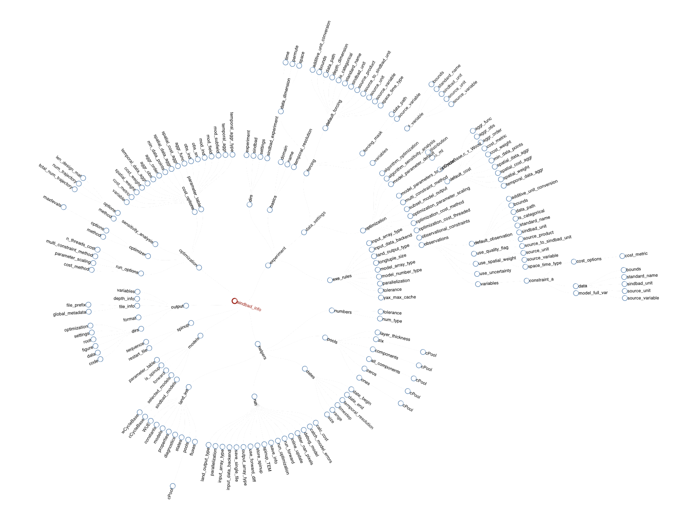

# SINDBAD `info` Structure

The `info` structure serves as the central information hub for SINDBAD experiments. During experiment initialization, the SINDBAD preprocessor parses configuration settings and consolidates them into a comprehensive `NamedTuple` named `info` that ensures consistency and type stability from input through model simulation to output.

::: danger Reserved Variable

The `info` variable name is strictly reserved within SINDBAD and plays a critical role in the model execution and stability. Users **must not** overwrite or modify this variable.

:::

## Purpose and Functionality

The `info` structure acts as the central nervous system of a SINDBAD experiment, containing all necessary information for:
- Data ingestion and processing
- Model initialization and execution
- Optimization configuration
- Output generation and analysis

## Structure Overview

The `info` structure is organized into six main branches:

### 1. Experiment Configuration (`experiment`)
Contains experiment metadata and file paths:
- Basic information: name, domain, version, user, execution date
- Configuration file paths
- settings for input data

### 2. Terrestrial Ecosystem Model (`models`)
Stores model-specific information:
- Model processes
- Spinup model selection
- parameters of the model structure

### 3. Simulation Output (`output`)
Stores information related to output
- output format and directories
- output variables

### 4. Model Spinup (`spinup`)
Information on how to do model spinup
- a path to restart file, if given
- sequence of spinup steps

### 5. Model helpers (`helpers`)
Intermediary helper objects necessary for model run and type stability
- dates and time steps needed for temporal aggregation
- initial instantiation of SINDBAD `land`
- numbers for selected `type` and numerical or mass-balance tolerance
- runtime options and information of experiment

### 6. Optimization Settings (`optimization`)
Available when parameter estimation or model cost calculation is enabled:
- Optimization algorithm settings (`optimizer`)
- Sensitivity analysis settings, when needed/set in `optimization.json` (`sensitivity_analysis`)
- Cost function configuration (`cost_options`)
- Parameter table with optimization parameters and their information
- Options for running optimization (`run_options`)

Interactively [view an example info from a SINDBAD experiment](http://sindbad-mdi.org/pages/concept/sindbad_info/sindbad_info.html)

## Usage Guidelines

- Access information using dot notation (e.g., `info.experiment.name`)
- Refer to specific fields when configuring model components
- Use the structure to track experiment settings and state and cross check if the json settings are correctly parsed and consolidated
- Maintain consistency with configuration files