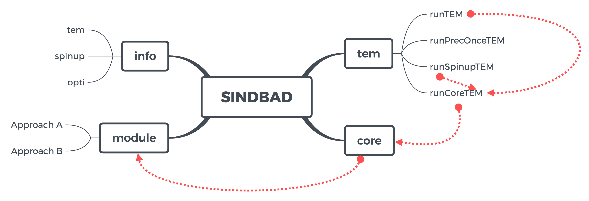

Figure: This is how you upload and image. Add an image to media folder, and use the above line.
# Main section
The SINDBAD framework provides a seamless integration of model and multiple data streams using different optimization schemes. For that, modularity regarding model structure, input/output handling and model optimization are key. These information on selected approaches and options are provided through configuration files, and they are stored in a consistent way in different SINDBAD objects and structures, so that the model technically always sees the same information. Fundamentally, SINDBAD consists of the following components:

## sub section

- I am a bullet point:

    - ***bold character***: I am the sub-bullet

### subsub section and so on

I can also handle code

```json
{
	"name": "FluxnetSiteOptimization",
	"domain": "FR-Hes",
	"configFiles": {
		"forcing"		: "settings/runOpti/forcing.json",
		"modelStructure": "settings/runOpti/modelStructure_cCycle_CASA.json",
		"constants"		: "settings/runOpti/constants.json",
		"modelRun"		: "settings/runOpti/modelRun.json",
		"output"		: "settings/runOpti/output.json",
		"spinup"		: "settings/runOpti/spinup.json",
		"params"		: "settings/runOpti/params.json",
		"opti"			: "settings/runOpti/opti.json"
	},
	"outputInfoFile": "sandbox/sb_runOpti/FR-Hes/FluxnetSiteOptimizationInfo4FR-Hes.json",
	"outputDirPath"	: "sandbox/sb_runOpti/FR-Hes/"
}
```

just replace json with matlab if you want to include matlab code


Let's make a table. Easiest way is to just create an excel table, and then copy paste into the following webpage. It will generate a  mardown table from pasted text
<https://www.tablesgenerator.com/markdown_tables>
